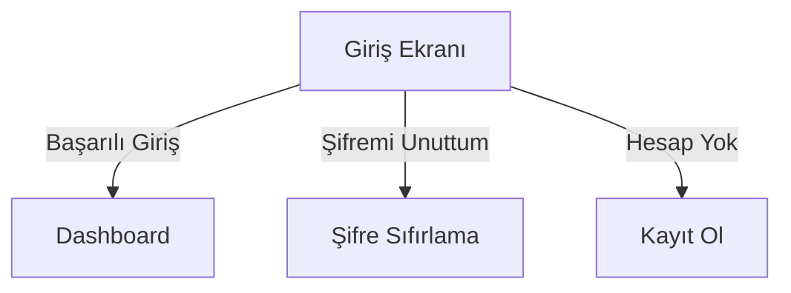

# 🎨 Kullanıcı Arayüzü Tasarım Dokümanı

## 🖥️ Tema ve Tasarım Sistemi

### 1. Tema Yapısı (Metronic Tabanlı)
```
src/
└── FinanceManagement.ClientApp/
    ├── public/
    │   ├── assets/           # Metronic statik dosyaları
    │   │   ├── css/         
    │   │   ├── js/
    │   │   ├── media/
    │   │   └── plugins/
    │   └── demo/            # Demo içerikleri
    └── src/
        ├── assets/
        │   ├── scss/        # Özel SCSS dosyaları
        │   └── images/      # Özel görseller
        └── _metronic/       # Metronic temel yapısı
```

### 2. Kullanılacak Bileşenler

#### 2.1 Ana Bileşenler
- **Dashboard Paneli**
  - Toplam bakiye kartı
  - Aylık gelir/gider grafiği
  - Son işlemler tablosu
  - Kategori bazlı harcama dağılımı

#### 2.2 Form Bileşenleri
- **Giriş/Üyelik Formları**
  ```jsx
  <Formik>
    <Form className="form w-100">
      <div className="fv-row mb-10">
        <label className="form-label fs-6 fw-bold text-dark">E-posta</label>
        <Field 
          type="email" 
          name="email" 
          className="form-control form-control-lg form-control-solid"
        />
      </div>
    </Form>
  </Formik>
  ```

### 3. Renk Şeması

| Bileşen | Renk Kodu | Kullanım Alanı |
|---------|-----------|----------------|
| Birincil | `#7239EA` | Butonlar, Önemli aksiyonlar |
| Başarı | `#50CD89`  | Olumlu durumlar |
| Uyarı | `#FFC700`   | Uyarı mesajları |
| Hata | `#F1416C`   | Hata mesajları |
| Arkaplan | `#F5F8FA` | Sayfa arkaplanı |

### 4. Tipografi

```scss
// _variables.scss
$font-family-sans-serif: 'Poppins', sans-serif;
$font-size-base: 1rem;
$h1-font-size: $font-size-base * 2.5;
$h2-font-size: $font-size-base * 2;
$h3-font-size: $font-size-base * 1.75;
```

### 5. Responsive Tasarım
- **Masaüstü**: 1200px ve üzeri
- **Tablet**: 992px - 1199px
- **Küçük Tablet**: 768px - 991px
- **Mobil**: 576px - 767px
- **Küçük Mobil**: 575px ve altı

### 6. Animasyonlar
- Sayfa geçişleri: Fade in/out
- Buton efektleri: Hover scale
- Yükleme animasyonları: Skeleton loader

### 7. Kullanıcı Akışları

#### 7.1 Giriş Akışı


### 8. Bileşen Kütüphanesi

#### 8.1 Kart Bileşeni
```jsx
const StatCard = ({ title, amount, icon, trend }) => (
  <div className="card">
    <div className="card-body p-5">
      <div className="d-flex align-items-center">
        <div className="symbol symbol-50px me-5">
          <span className="symbol-label">
            <i className={`fas fa-${icon} fs-2x`}></i>
          </span>
        </div>
        <div>
          <div className="fs-6 text-gray-400 fw-bold">{title}</div>
          <div className="fs-2 fw-bolder">{amount}</div>
          {trend && (
            <span className={`text-${trend.type} fw-bold d-block`}>
              {trend.value}% <i className={`fas fa-arrow-${trend.icon}`}></i>
            </span>
          )}
        </div>
      </div>
    </div>
  </div>
);
```

### 9. Kullanıcı Deneyimi İyileştirmeleri

#### 9.1 Yükleme Durumları
- Butonlarda yükleme animasyonu
- Sayfa yüklenirken skeleton loader
- İşlem sırasında disable durumu

#### 9.2 Hata Yönetimi
- Form validasyon hataları
- API hata mesajları
- Genel hata sınırları (Error Boundaries)

### 10. Performans Optimizasyonları
- Görsel optimizasyonu (WebP formatı, lazy loading)
- Kod bölme (Code splitting)
- Önbellek stratejileri

### 11. Erişilebilirlik (A11y)
- ARIA etiketleri
- Klavye navigasyonu
- Renk kontrast oranları

### 12. Test Senaryoları
- Cross-browser testleri
- Responsive testleri
- Kullanıcı akış testleri

---
*Son Güncelleme: 16 Aralık 2025*
